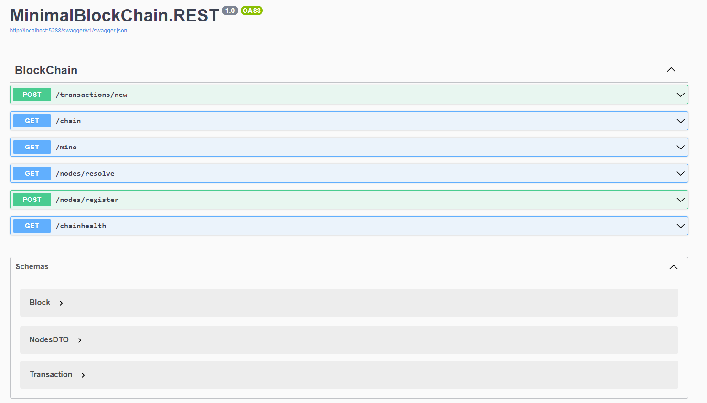

# Minimal BlockChain

## Umsetzung
Die Übung wurde mit .NET 6 umgesetzt. Im Großen und Ganzen habe ich mich an die Python-Vorlage gehalten.
Kleinere Details wie etwa DTOs etc. oder minimal veränderte Return Typen bei der REST-API sind aber die einzigen Abweichungen.

## Funktionalitäten
Jeder Node hat Zugriff auf die folgenden Funktionalitäten:


### Docker
Um nicht mehrere Instanzen laufen zu lassen habe ich ein Dockerfile geschrieben welches die REST-API (Node) als Service zur Verfügung stellt.

```Dockerfile
FROM mcr.microsoft.com/dotnet/sdk:6.0 AS build
WORKDIR /app

COPY MinimalBlockChain .
RUN cd MinimalBlockChain
RUN dotnet restore
RUN dotnet publish -o /app/published-app

FROM mcr.microsoft.com/dotnet/aspnet:6.0 as runtime
WORKDIR /app
COPY --from=build /app/published-app /app
ENTRYPOINT ["dotnet", "/app/MinimalBlockChain.REST.dll"]
```

Danach wurden 3 Nodes erstellt mittels einem docker-compose File:
```yml
version: '3'

services:
  node1:
    build: .
    ports:
      - 5001:80

  node2:
    build: .
    ports:
      - 5002:80

  node3:
    build: .
    ports:
      - 5003:80
```

Aus Gründen der Einfachheit habe ich aber den Standardport `80` verwendet und nicht `5000`.

## Testen
Um die Funktionalität zu testen wurde ein `http` File angelegt:
```http
### Add Transactions to first node
POST /transactions/new HTTP/1.1
Host: localhost:5001
Content-Type: application/json
Content-Length: 81

{
    "Sender": "franzfilip",
    "Recipient": "finanzamt",
    "Amount": 5
}

### Add Transactions to first node
POST /transactions/new HTTP/1.1
Host: localhost:5001
Content-Type: application/json
Content-Length: 81

{
    "Sender": "notme",
    "Recipient": "dubiosesgeschaeft",
    "Amount": 10
}

### Mine new block
GET /mine HTTP/1.1
Host: localhost:5001

### Show chain
GET /chain HTTP/1.1
Host: localhost:5001

### Validate health
GET /chainhealth HTTP/1.1
Host: localhost:5001

### Add Transactions to first node
POST /transactions/new HTTP/1.1
Host: localhost:5001
Content-Type: application/json
Content-Length: 81

{
    "Sender": "franzfilip",
    "Recipient": "keindubiosesgeschaeft",
    "Amount": 1
}

### Mine new block
GET /mine HTTP/1.1
Host: localhost:5001

### Show chain
GET /chain HTTP/1.1
Host: localhost:5001

### Register nodes at node 1
POST /nodes/register HTTP/1.1
Host: localhost:5001
Content-Type: application/json

{
  "nodes": [
    "http://node2:80",
    "http://node3:80"
  ]
}

### Register nodes at node 2
POST /nodes/register HTTP/1.1
Host: localhost:5002
Content-Type: application/json

{
  "nodes": [
    "http://node1:80",
    "http://node3:80"
  ]
}

### Register nodes at node 3
POST /nodes/register HTTP/1.1
Host: localhost:5003
Content-Type: application/json

{
  "nodes": [
    "http://node1:80",
    "http://node2:80"
  ]
}

### Nodes resolve for node 1
GET /nodes/resolve HTTP/1.1
Host: localhost:5001

### Nodes resolve for node 2
GET /nodes/resolve HTTP/1.1
Host: localhost:5002

### Nodes resolve for node 3
GET /nodes/resolve HTTP/1.1
Host: localhost:5003
```